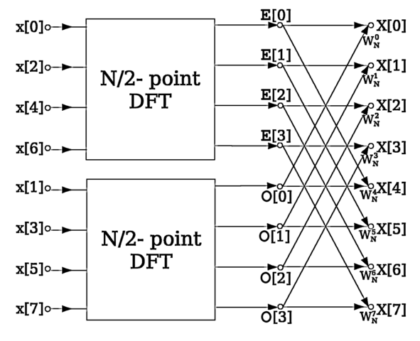

  

Image by Virens, licensed under the [Creative Commons Attribution 3.0
Unported](https://creativecommons.org/licenses/by/3.0/deed.en) license.

# Cooley-Tukey FFT on the Xtensa Architecture

This is an implementation of the Cooley-Tukey FFT algorithm for one of
Tensilica's Xtensa processor platforms. The Tensilica Instruction Extension
hardware-description DSL is utilized to customize the core Xtensa core
architecture by means of additional specialized registers and instructions
which make it possible to perform the specialized task of computing a DIT/DIF
FFT at significantly higher speeds than would ordinarily be possible with the
base ISA alone. Hardware acceleration results in a > x25 speedup for moderately
large inputs:

  

See the report under `submodules/report/pdf` for a detailed
description of the design and implementation of this project as well as
performance and chip area analyses.

The algorithm itself is implemented in assembly in `project/source/asm/fft.S`,
the instruction set extensions are implemented in `project/source/tie/fft.tie`
in the aforementioned TIE language. In order to actually simulate this design
you would need a commercial licence for the Xtensa SDK.
